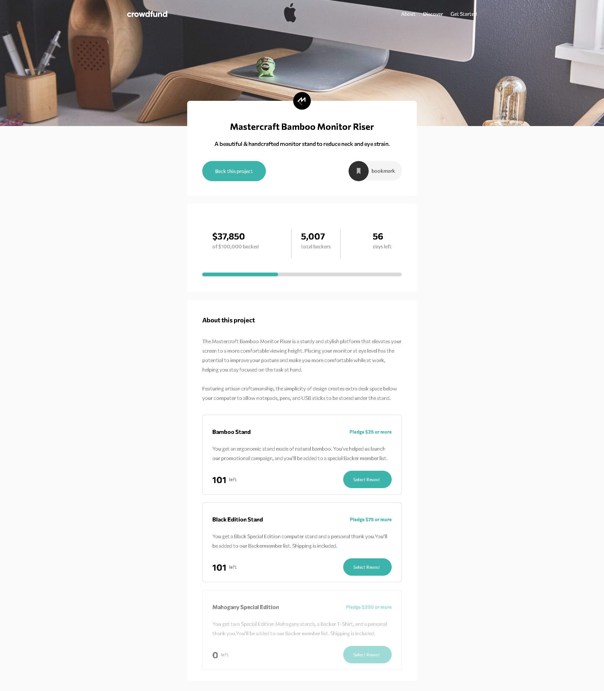

# Frontend Mentor - Crowdfunding product page solution

This is a solution to the [Crowdfunding product page challenge on Frontend Mentor](https://www.frontendmentor.io/challenges/crowdfunding-product-page-7uvcZe7ZR). Frontend Mentor challenges help you improve your coding skills by building realistic projects.

## Table of contents

- [Overview](#overview)
  - [The challenge](#the-challenge)
  - [Screenshot](#screenshot)
  - [Links](#links)
- [My process](#my-process)
  - [Built with](#built-with)
  - [What I learned](#what-i-learned)
  - [Useful resources](#useful-resources)
- [Author](#author)

**Note: Delete this note and update the table of contents based on what sections you keep.**

## Overview

### The challenge

Users should be able to:

- View the optimal layout depending on their device's screen size
- See hover states for interactive elements
- Make a selection of which pledge to make
- See an updated progress bar and total money raised based on their pledge total after confirming a pledge
- See the number of total backers increment by one after confirming a pledge
- Toggle whether or not the product is bookmarked

### Screenshot

### Links

- Live Site URL: [ live site URL here](https://your-live-site-url.com)

## My process

- setup react project
- bulid layout component with styled component
- thinking for logic

### Built with

- Semantic HTML5 markup
- CSS custom properties
- Flexbox
- CSS Grid
- useContent for global state
- framer motion (js library) for animate
- [React](https://reactjs.org/) - JS library
- [Styled Components](https://styled-components.com/) - For styles

**Note: These are just examples. Delete this note and replace the list above with your own choices**

### What I learned

I tried framer motion for the first time and I'm pretty happy with it. But still have problems naming components and folder arrangement. I will try something new Increase in the next project... figma is pain to me because there is no Pro. Sorry for the bad English :).

## What problem in project

- naming :(
- folder structure
- waste time for figma file .... i clone png image and create new figma design for it

## Author

- Frontend Mentor - [@Sitthisak Intharak](https://www.frontendmentor.io/profile/Sittisukintaruk)

## Useful resources

- framer motion - [framer](https://www.framer.com/motion/)
